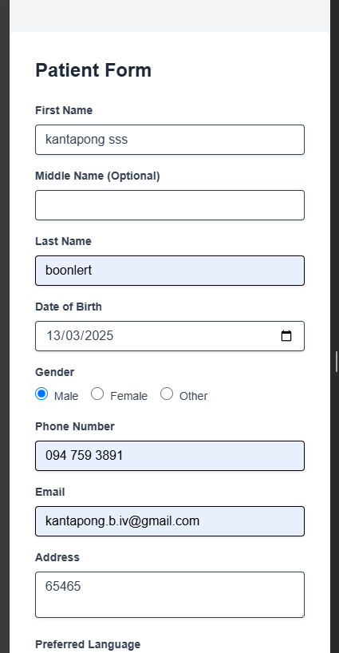
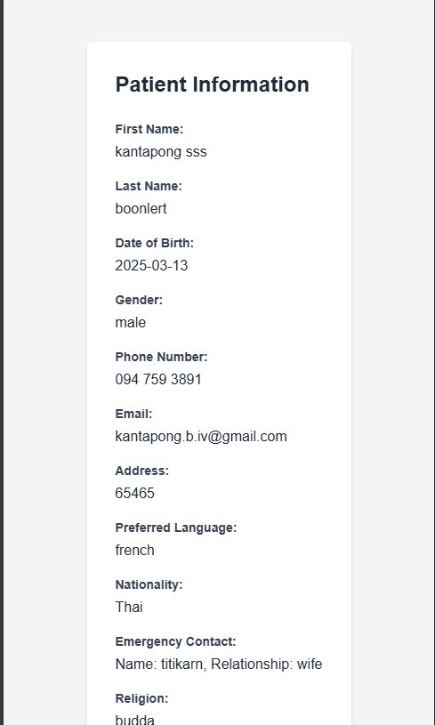

# Agnos Candidate Assignment

Develop a responsive, real-time patient input form and staff view system. The project consists of
two main interfaces:
● Patient Form: A responsive form where patients can enter their information.
● Staff View: A real-time, responsive interface for staff members to monitor the information being entered in the patient form.

## List of contents
- [Installation](#Installation)
- [Usage](#Usage)
- [Routes](#Routes)
- [Project Structure](#Project-Structure)
- [Realtime Flow](#Realtime-Flow)
- [Screenshot](#Screenshot)

## Installation 
```bash
npm install
```

## Usage
start server 
  ```bash 
  npm run ws
  ```
run dev 
  ```bash 
  npm run dev
  ```
build for production 
  ```bash 
  npm run build
  ```

## Routes
### patient/
patient form page

### staff/
staff view page

## Project Structure 

### app/
React component of each pages 

### app/patient
Patient react component that only use in patient page

### app/staff
Staff react component that only use in staff page

### components/
React component for reuse

### models
Interfaces of any component props or state

### server
Websocket server

## Realtime Flow
Both of them sync data realtime by using websocket send and receive data.

## Screenshot



